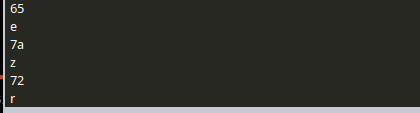
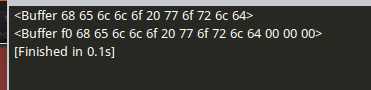

# Buffer数据流
[TOC]
### 1 创建Buffer
```JavaScript
#创建一个指定长度但是没有初始值的Buffer对象；`size`是数字，表示Buffer对象的长度
var buffer = new Buffer(size);
console.log(buffer);

# 创建一个有初始值的Buffer对象
var buffer = new Buffer([1,2,3]);
console.log(buffer);

#创建字符串的Buffer
var buffer = new Buffer(str,encode);
console.log(buffer);

buffer[i].tostring(16)#转换为16进制
String.fromCharCode(buffer[i])#把Buffer数据转换成utf-8编码
```
*结果展示：*



### 2 字符串写入Buffer
```JavaScript
#字符串写入Buffer
str = 'hello world';
console.log(new Buffer(str));
buffer = new Buffer(15);
buffer.write(str,1)#从Buffer对象的第二个字符开始填充
console.log(buffer);
#补充
buffer.write(str,1)#截取字符串的1-3个字符

#toJSON(),把Buffer变成Json对象

#buffer.slice(),截取Buffer对象，可填写起始位置，该操作会影响到原来的对象
#buffer.copy(),复制Buffer对象，操作不会影响原来的对象。
```
*对比：*




