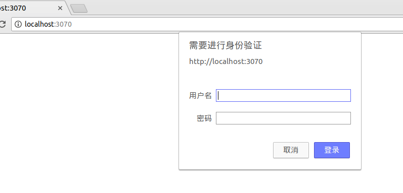

# express中间件
[TOC]
### 1 了解中间件
* static:允许Express服务器以流式处理文件的`GET`请求。这个中间件是Express内置的，它可以通过express.static()访问。
* express-logger:实现一个格式化的请求记录来跟踪对服务器的请求。
* basic-auth-connect:提供对基本的HTTP身份验证的支持
* cookie-parser:你可以从请求读取cookie并在响应中设置cookie
* cookie-session：提供基于cookie的会话支持。
* express-session：提供了一个相当强大的会话实现
* body-parser:把Post请求正文中的Json数据解析为req.body属性
* compression:对发给客户端的大响应提供Gzip压缩支持
* csurf:提供跨站点请求伪造保护。

### 2 使用中间件
要对所有的路由指定中间件，可以再Express app对象上使用`ues()`方法。`use()`方法的语法如下：
```
use([path],middleware)
```
`path`变量是可选的，默认为`/`,这意味着所有的路径。`middleware`参数是一个函数，它的语法如下，其中`req`是`Request`对象，`res`是`Response`对象，`next`是要执行的下一个中间件函数：
```
function(req, res, next)
```
每个中间件组件都有一个构造函数，它返回相应的中间件功能。
把`body-parser`中间件应用于所有路径
```JavaScript
var express = require('express);
var bodyParser = require('body-parser');
var app = express();
app.use('/',bodyParser());
```
### 3 基本的http身份验证
Http身份验证使用Authorization标头从浏览器向服务器发送编码后的名户名和密码。如果在浏览器中没有储存URL授权信息，浏览器会启动一个基本的登录对话框，让用户输入用户名和密码。
`Express`的`basic-auth-connect`中间件函数提供对处理基本的http身份验证的支持。`basic-auth-connect`中间件使用以下语法：
```JavaScript
var basicAuth = require('basic-auth-connect');
basicAuth(function(user,password){})
```
传递到`basic-auth-connect`的函数接受用户名和密码。然后如果它们是正确的，则返回True；如果是错误的，则返回False。例如：
```javascript
app.use(basicAuth(function(user,password){
return (user ==='testuser' && password ==='123');
}))
```
通常情况下你在数据库中存储用户名和密码，然后在`authentication`函数中检索要验证的用户对象。
#### 在全局范围验证
```JavaScript
var express = require('express');
var basicAuth = require('basic-auth-connect');
var app = express();

app.listen(3070);

app.use(basicAuth(function (user, password) {
    return (user === 'pzx' && password === '1234');
}));

app.get('/', function(req, res){
    res.send("验证成功！");
});
```
运行上面的代码，在浏览器中打开对应的本地端口，显示如下：



输入用户名和密码后：


一个简单的验证就实现了。

#### 单个路由验证
```JavaScript
var basicAuth = require('basic-auth-connect');
var auth = basicAuth(function (user, password) {
    return (user === 'pzx' && password === '1234');
});
router.get('/user', auth,function (req, res,next) {
    res.render('user');
});
```
修改验证为单个页面后，进入主页后就不需要验证了，但是访问加了安全验证的就需要验证


