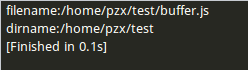
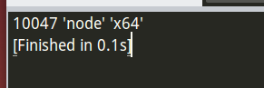
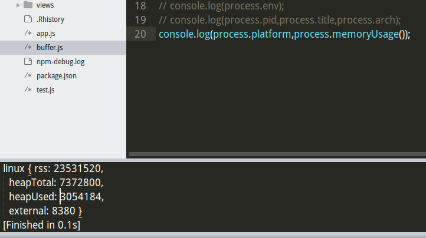
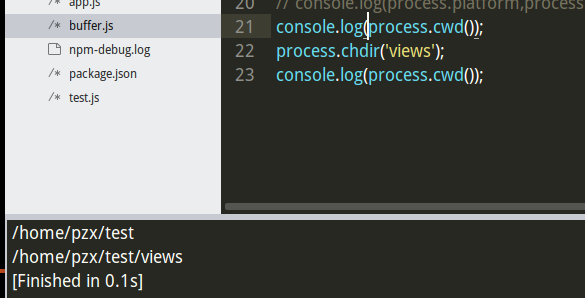

# Node学习——global对象(全局对象)
### 1 `__filename`
该属性并不是全局对象，它是模块作用域下的属性；它的作用是返回当前文件解析后的绝对路径

### 2 `__dirname`
该属性并不是全局对象，它是模块作用域下的属性；它的作用是返回当前文件所在的文件夹
*filename和dirname的区别：*



### 3 日期对象、数组
```JavaScript
var d = new Date()//日期对象
d.getFullYear()//获取年份
d.getMonth()//获取月份
d.getDate()//获取当天号数
d.getHours()
d.getMinutes()
d.getSeconds()
new Array()//数组对象
```

### 4 定时器
```JavaScript
setInterval(function(){
	执行语句；
},time);
该函数会一直执行。
```

### 5 process
它是一个控制进程对象的全局对象。
```JavaScript
process.argv//一组包含命令行参数的数组
process.execPath//开启当前进程的绝对路径
process.env//返回当前用户环境信息
process.pid//返回当前进程的pid
process.title//返回当前进程的显示名称
process.pid//返回当前CPU处理器架构 arm/ia32/x64中的一个
```


补充：
```JavaScript
process.platform//返回当前操作系统平台
process.chdir(derectory)//改变进程的工作目录
process.memoryUsage()//返回node进程的内存使用情况，单位是byte
process.exit(code)//退出
process.kill(pid)//向进程发送信息
```
*系统信息和占用内存：*



*切换工作目录：*



### 6 process标准输入、输出流
```javascript
process.stdin.on('data', function(chunk){
 语句；
});//标准输入流
process.stdout.write('xsxsx')//标准输出流
他们提供了操作输入数据和输出数据的方法；也称为I/O操作
```
```JavaScript
//用户输入检测：
process.stdin.on('data', function(chunk){
    console.log("您输入了:" + chunk);
});
```

