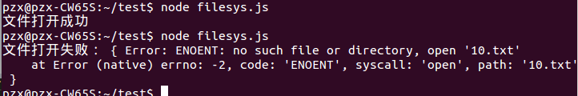
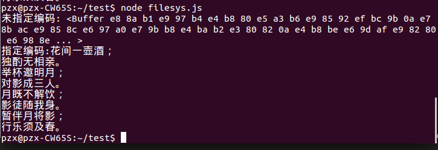
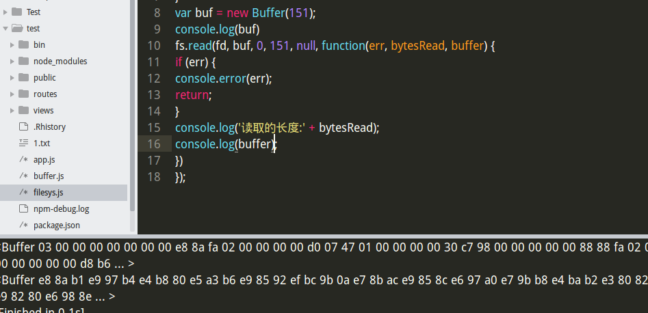

# 文件系统
[TOC]
### 1 打开文件
```JavaScript
var fs = require('fs')//引入文件读写模块
fs.open(path, flags, [mode], callback)
     path:要打开的文件的路径
     flags:打开文件的方式 读/写
     mode: 设置文件的模式 读/写/执行-->4/2/1 
     callback: 回调函数 
         参数：err:文件打开失败的错误保存在err里面，如果成功err为null；
         fd：被打开文件的标识;可以通过返回的标识号操作定时器
      
//具体代码
fs.open('1.txt', 'r', function (err, fd) {
    // body...
   if (err) {
    console.log('文件打开失败：',err);
   }else{
    console.log('文件打开成功');
   }
});
```
*打开成功和失败的情况：*



### 2 读取文件
#### 方法一、`readFile()`
`fs.readFile(filename,[encoding],[callback(err,data)])`是最简单的读取
文件的函数。它接受一个必选参数`filename`,表示要读取的文件名。第二个参数`encoding`是可选的,表示文件的字符编码。`callback`是回调函数,用于接收文件的内容。如果不指定`encoding`,则`callback`就是第二个参数。回调函数提供两个参数`err`和`data`,`err`表示有没有错误发生,`data`是文件内容。如果指定了`encoding`,`data`是一个解析后的字符串,否则`data`将会是以`Buffer`形式表示的二进制数据。
看一下没指定编码和指定编码的区别：
```JavaScript
//不指定编码
fs.readFile('1.txt',function(err, data){
	console.log(data);
});
//指定编码
fs.readFile('1.txt',encoding='utf-8',function(err, data){
	console.log(data);
});
```



#### 方法二、`fs.read()`
`fs.read(fd, buffer, offset, length, position, [callback(err, bytesRead,buffer)])`是`POSIX read`函数的封装,相比`fs.readFile`提供了更底层的接口。`fs.read`的功能是从指定的文件描述符`fd`中读取数据并写入`buffer`指向的缓冲区对象。`offset`是`buffer`的写入偏移量。`length`是要从文件中读取的字节数。`position`是文件读取的起始位置,如果`position`的值为`null`,则会从当前文件指针的位置读取。回调函数传递`bytesRead`和`buffer`,分别表示*读取的字节数*和*缓冲区对象*。
```JavaScript
//以下是一个使用 fs.open 和 fs.read 的示例。
var fs = require('fs');
fs.open('content.txt', 'r', function(err, fd) {
if (err) {
console.error(err);
return;
}
var buf = new Buffer(8);
fs.read(fd, buf, 0, 8, null, function(err, bytesRead, buffer) {
if (err) {
console.error(err);
return;
}
console.log('bytesRead: ' + bytesRead);
console.log(buffer);
})
});
```
*读取成功*



可以通过Buffer.toString()把Buffer对象转换成字符串。
