# 基于nodejs爬虫的信息采集展示的桌面APP

[TOC]

### 序、项目介绍

```
1.Request
2.Cheerio
3.Requirejs
4.NW.js
```

### 一、项目开始

#### 1 创建项目
```
$ mkdir jokeReader
$ cd jokeReader
$ git init
```
然后就会出现类似下面的界面：

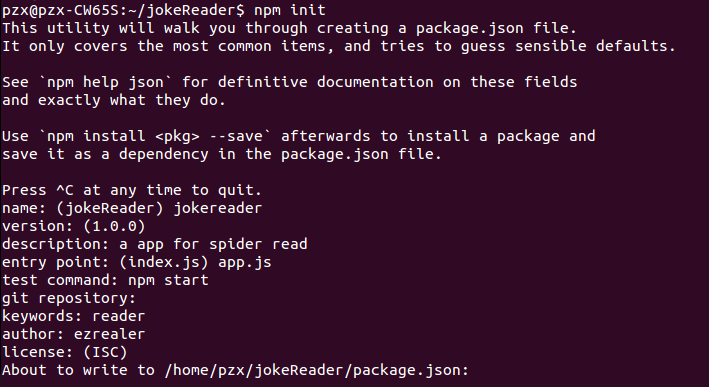

根据自己的喜好填写即可，不会影响项目的正常运行。

### 二、安装并测试各个模块

1.安装需要的三个模块：
```
$ npm install request --save
$ npm install cheerio --save
$ npm install requirejs --save
```
*模块安装成功:*

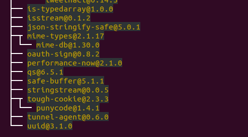

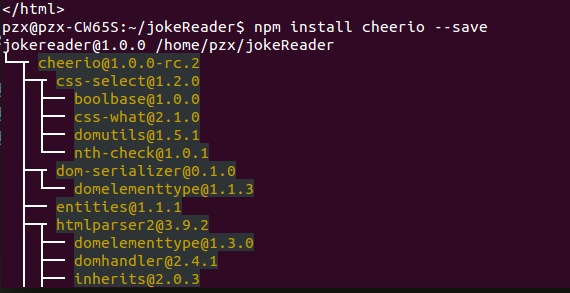

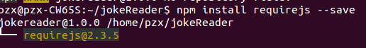

2.测试模块
在刚才创建的项目文件夹下新建`app.js`文件
```JavaScript
var request = require('request');
var cheerio = require('cheerio');
var requirejs = require('requirejs');
request('http://www.yikedou.com/fuqixiaohua/201704/76455.html', function (error, response, body) {
  console.log('error:', error); // Print the error if one occurred
  console.log('statusCode:', response && response.statusCode); // Print the response status code if a response was received
  console.log('body:', body); // Print the HTML for the Google homepage.
});
```
然后运行项目：
```
$ node app.js
```
*运行结果:*

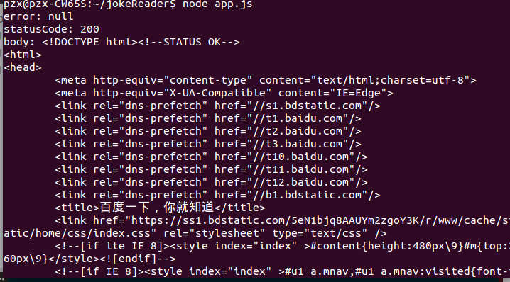

我们可以看到`error： null`表示没有错误；`statusCode：200`表示请求成功；`<body>`是我们测试数据是否正常返回。一切正常。

*测试`Cheerio`模块*
```JavaScript
var request = require('request');
var cheerio = require('cheerio');
var requirejs = require('requirejs');
var fs = require('fs');

var url = 'http://www.yikedou.com/fuqixiaohua/201704/76455.html'
request(url, function (error, response, body) {
  // console.log('body:', body); // Print the HTML for the Google homepage.
  fs.writeFile('test.txt', body, function (err) {
      // body...
      if (err) {
        console.log(err);
      }
      else{
            console.log("写入成功");
      }
  });
  const $ = cheerio.load(body) ;
  console.log($);
});
```

运行结果：

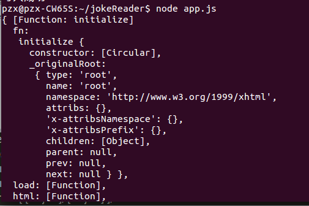

爬取结果：

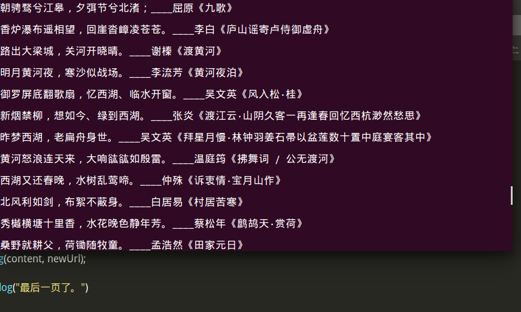

### 3 爬取策略
首先，找到了古诗文网的链接`http://so.gushiwen.org/mingju/Default.aspx?p=1&c=&t=`，准备从这个链接开始，获得所有的页面。
第一步：获得每一页的URL；
第二步：爬取每一页的内容。
第三步：做成APP。

#### 1 获取所有页面
经过我的观察，发现页面的链接是有规律的：
```
http://so.gushiwen.org/mingju/Default.aspx?p=1&c=&t= //第一页
http://so.gushiwen.org/mingju/Default.aspx?p=2&c=&t= //第二页
http://so.gushiwen.org/mingju/Default.aspx?p=50&c=&t= //第五十页
```
总共有116页。所以，所有的URL可以这样获取：
```JavaScript
for(i=1;i<=116;i++){
	nextUrl =  'http://so.gushiwen.org/mingju/Default.aspx?p=' + i+ '&c=&t=';
}
```
*执行一下，看看结果是否正确：*

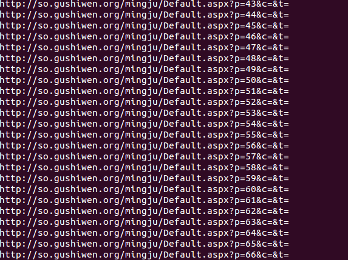

获得了所有的URL并且都是正确的。接下来就是提取每一页的内容：
```JavaScript
var request = require('request');
var cheerio = require('cheerio');
var requirejs = require('requirejs');
var fs = require('fs');

var url = 'http://so.gushiwen.org/mingju';
// var url = 'http://www.dytt8.net/';

function getHtml(url) {
    request(url, function (error, response, body) {
        const $ = cheerio.load(body, {decodeEntities: false}) ;
        var content = $('.cont').text();
        console.log(content);
});
}

//获得所有页面的URL
for (var i = 1; i <= 116; i++) {
            var nextUrl = 'http://so.gushiwen.org/mingju/Default.aspx?p=' + i+ '&c=&t=';
            getHtml(nextUrl);
 }
```

运行到一半就出错了：

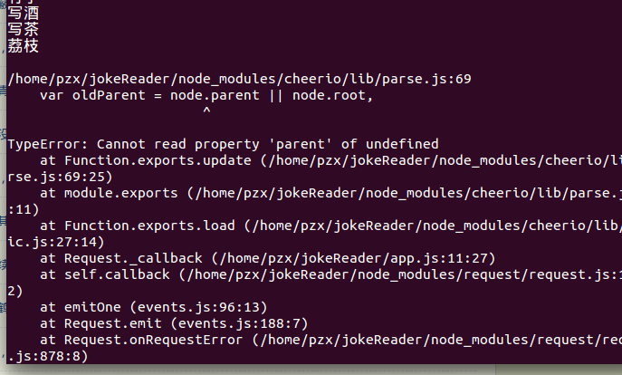

在`stackoverflow`上找到了答案：
```JavaScript
As chrki already said, cheerio.load() is called with an empty value like null or an empty string. Check whether the value contains something before you call .load():

if (res.text) {
    var $ = cheerio.load(res.text);
} else {
    // do something else
}
```
所以我修改了一下代码：
```JavaScript
var request = require('request');
var cheerio = require('cheerio');
var requirejs = require('requirejs');
var fs = require('fs');

var url = 'http://so.gushiwen.org/mingju';
// var url = 'http://www.dytt8.net/';

function getHtml(url) {
    request(url, function (error, response, body) {
        if (body) {
            const $ = cheerio.load(body, {decodeEntities: false}) ;
            var content = $('div.cont').text();
            console.log(content);
        }else{
            console.log("内容为空");
        }
        
});
}

//获得所有页面的URL
for (var i = 1; i <= 116; i++) {
            var nextUrl = 'http://so.gushiwen.org/mingju/Default.aspx?p=' + i+ '&c=&t=';
            getHtml(nextUrl);
 }
```
果然正确了：

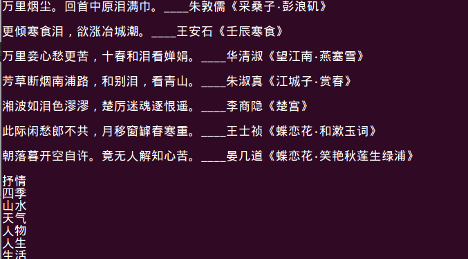

但是我们只想要诗句，却出现了一些标签。所以把它去掉。经过观察发现：它的`div`层级是这样的：

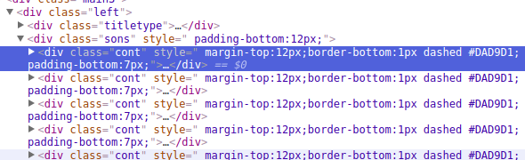

所以我修改了获取内容的代码：
```JavaScript
request(url, function (error, response, body) {
            const $ = cheerio.load(body, {decodeEntities: false}) ;
            var content = $('div.left>div.sons>div.cont>a').text();
            console.log(content);
```

已经成功的除去了那些标签：

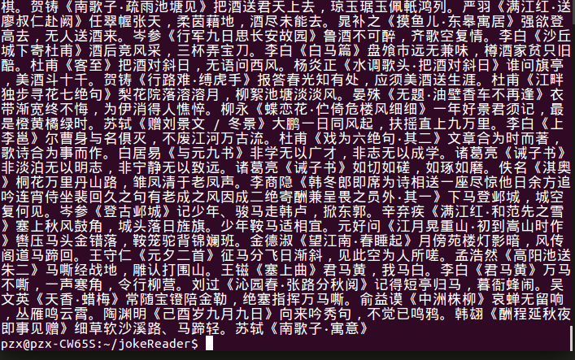

最终确认爬取的函数代码如下：
```JavaScript
function getHtml(url) {
    request(url, function (error, response, body) {
        if (body) {
            const $ = cheerio.load(body, {decodeEntities: false});
            contents = $('div.left>div.sons>div.cont').html();
            // console.log(contents);
            fs.appendFile('古诗名句.txt', contents，function(err){
            	if(err):{
                console.log(err);
                }
            });
            for (var i = 1; i <= 116; i++) {
            var nextUrl = 'http://so.gushiwen.org/mingju/Default.aspx?p=' + i+ '&c=&t=';
            getHtml(nextUrl);
        }
    }else{
        console.log('内容空');
    }
});
}
```
*这次看起来整洁多了：*

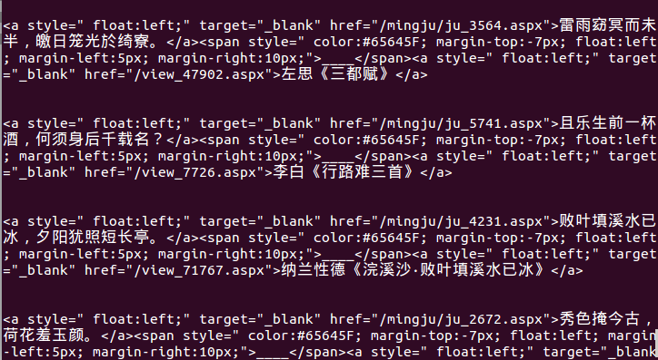

但是运行到中途却报错了：

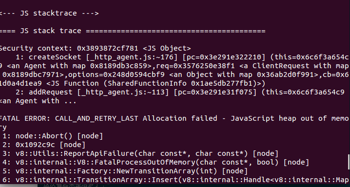

同样的，我在 [stackoverflow](https://stackoverflow.com/questions/26094420/fatal-error-call-and-retry-last-allocation-failed-process-out-of-memory) 找到了问题的原因：这是递归堆栈导致内存溢出。但这不是主要的原因。主要的原因是我使用了太多的异步函数调用和循环的嵌套。才导致内存溢出。所以改写一下函数代码，尽量少使用异步函数的嵌套调用。
我把文件写入的函数改为同步函数`fs.appendFileSync('古诗名句.txt', contents);`;得到的写入结果是一步函数写入结果的`60-100`倍。所以，还要再修改主函数中的异步调用：`equest(url, function (error, response, body){}）`


