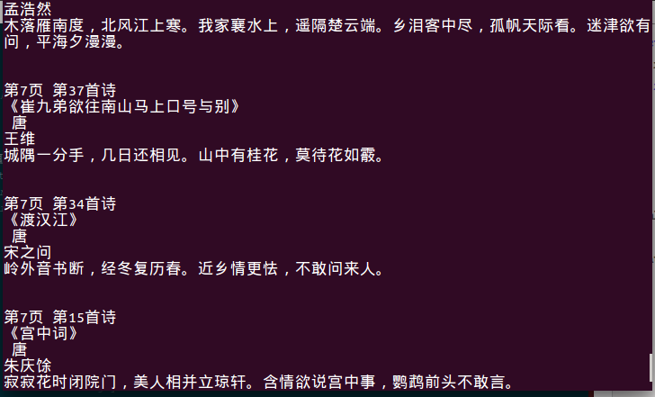
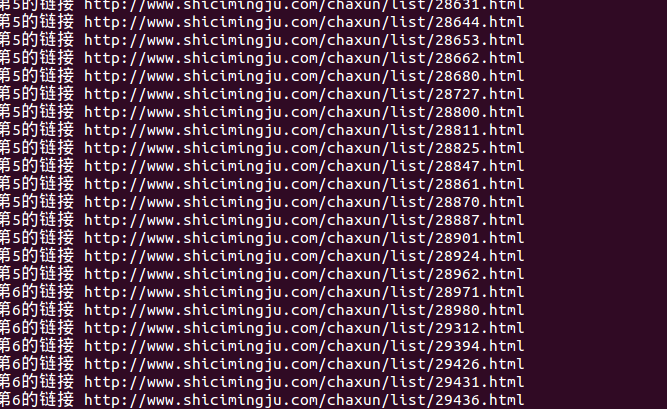

# 改良版爬虫
经过上次内存溢出的情况后，我改写了代码，减少了异步嵌套循环的使用。最终解决了内存溢出的问题：
```JavaScript
var request = require('request');
var fs = require('fs');
var cheerio = require('cheerio');

urlSite = 'http://www.shicimingju.com';
// url = 'http://www.shicimingju.com/shicimark/tangshisanbaishou_8.html';

//唐诗
for (var i = 1; i<=8; i++) {
    var nextUrl = 'http://www.shicimingju.com/shicimark/tangshisanbaishou_'+i+'.html';
    getPageUrl(nextUrl,i);
    // console.log(nextUrl);
}

//宋词
// for (var i = 1; i<=8; i++) {
//     var nextUrl = 'http://www.shicimingju.com/shicimark/songcisanbaishou_'+i+'.html';
//     getPageUrl(nextUrl,i);
//     // console.log(nextUrl);
// }

//获取一个页面中的所有链接
function getPageUrl(url,page) {
    request(url, function (error, response, body) {
    if (!error && response.statusCode == 200) {
        // console.log(body);
        var $ = cheerio.load(body, {decodeEntities: false});
        var urls = $('div.yuanjiao.shicimark>ul>li a').html();
        $('div.yuanjiao.shicimark>ul>li>a:nth-child(1)').each(function(i, e) {
                var halfUrl =$(e).attr('href');
                var completeUrl = urlSite + halfUrl;
                getContent(page,i,completeUrl);
                console.log(page,completeUrl);
            });
    }
});
}

//获取页面中的诗歌的标题、年代、作者和内容
function getContent(page,i,url) {
    request(url, function (error, response, body) {
    if (!error && response.statusCode == 200) {
        // console.log(body);
        var $ = cheerio.load(body, {decodeEntities: false});
        var $content = $('div#middlediv>div.zhuti.yuanjiao').html();
        var title = $('div#middlediv>div.zhuti.yuanjiao>h2').text();
        var year = $('div#middlediv>div.zhuti.yuanjiao>.jjzz>a:nth-child(1)').html();
        var author = $('div#middlediv>div.zhuti.yuanjiao>.jjzz>a:nth-child(2)').html();
        var content = $('div#shicineirong').text();
        console.log('\n');
        console.log('第' + page  +'页','第' + (i+1) + '首诗');
        console.log(title);
        console.log(year);
        console.log(author);
        console.log(content);
    }
});
}

// getPageUrl(url1,1);
```




