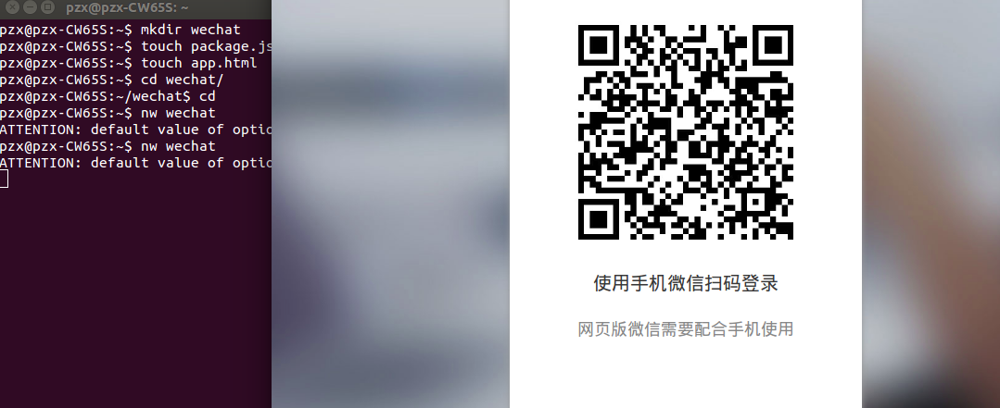
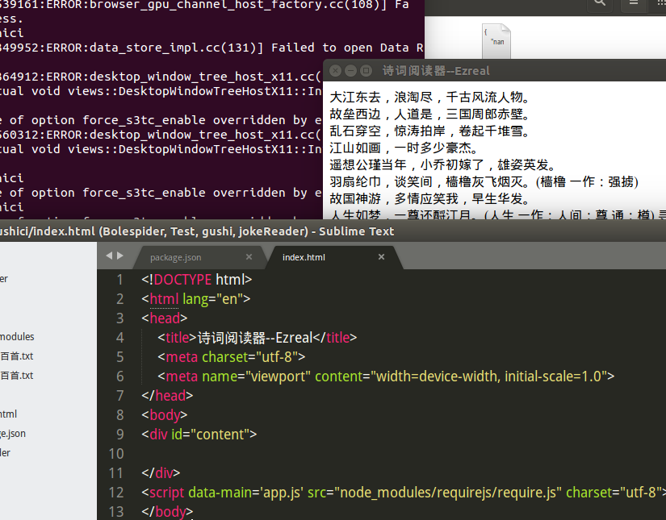
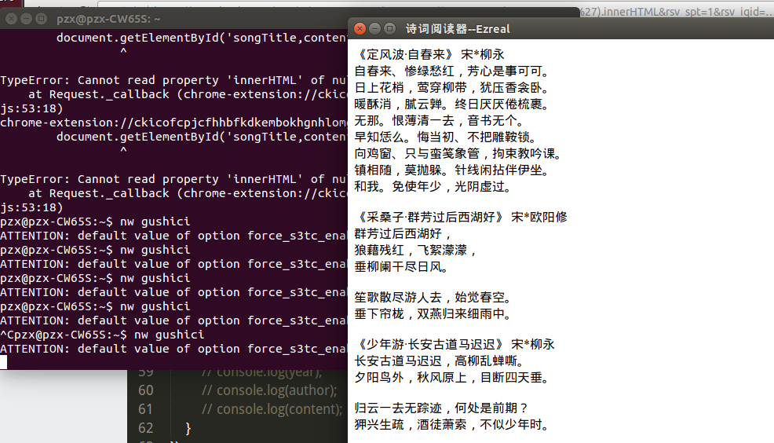
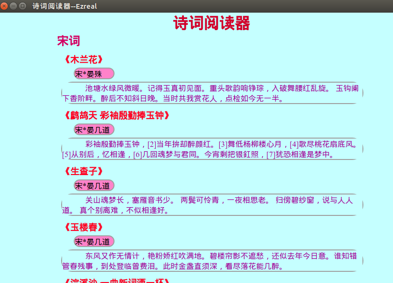

# Node爬虫信息制作APP

### 1 信息采集
我的信息来自古诗词网站：[网站地址](http://www.shicimingju.com/shicimark/songcisanbaishou_1.html)。

### 2 采集信息代码编写
**片段：**
```JavaScript
var request = require('request');
var fs = require('fs');
var requirejs = require('requirejs');
var http = require('http');
var cheerio = require('cheerio');

//获取页面中的诗歌的标题、年代、作者和内容
function getContent(page,i,url) {
    request(url, function (error, response, body) {
    if (!error && response.statusCode == 200) {
        // console.log(body);
        var $ = cheerio.load(body, {decodeEntities: false});
        // var $content = $('div#middlediv>div.zhuti.yuanjiao').html();
        var title = $('div#middlediv>div.zhuti.yuanjiao>h2').text();
        var year = $('div#middlediv>div.zhuti.yuanjiao>.jjzz>a:nth-child(1)').text();
        var author = $('div#middlediv>div.zhuti.yuanjiao>.jjzz>a:nth-child(2)').text();
        var content = $('div#shicineirong').text();
        var contents = '<div calss=complete-songci>' + '<h3>' + title + '</h3>' + '<div class=year-author>' + year + '*' + author + '</div>' + '<div class=songci><p>' + content + '</p></div>' + '</div>';
        // document.getElementById('songTitle').innerHTML += title;
        document.getElementById('content').innerHTML += contents;
        // fs.appendFileSync('宋词三百首.txt', [title+year+'*'+author+'\n'+content+'\n'+'\n']);
        // console.log('\n');
        // console.log('第' + page  +'页','第' + (i+1) + '首诗');
        // console.log(title);
        // console.log(year);
        // console.log(author);
        // console.log(content);
    }
});
}

// getPageUrl(url1,1);
```

### 3 制作APP
信息采集到以后，就可以利用它制作我们跨平台的APP了。首先，需要一个叫`nw.js`的工具。我已经下载好了，先随便写试试：



果然成功了。然后可以利用它来写我们的诗词阅读器的app。
**初步写入数据测试：**



OK！没问题。可以继续。
**我们加入更多的信息：**



信息都加入成功了。接下来，便是app界面的美化了。这个界面真不好看。

### 4 美化APP
APP的美化就是增加`css`等等，经过长达一小时的调试。我的APP界面终于能看了：

