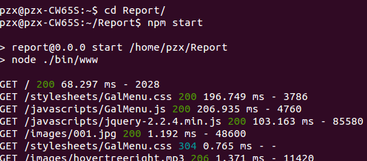
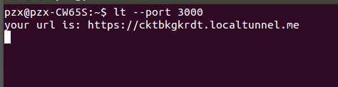
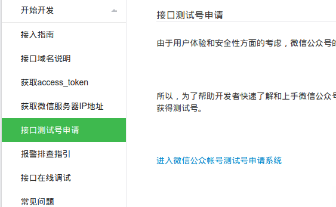
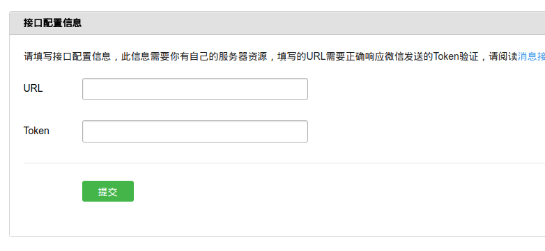

# Node开发微信公众号1

## 1 微信号分类
1. `企业号：`不适合个人小型开发，是为企业级或组织提供移动应用入口，帮助企业建立与员工、上下游供应链及企业应用间的连接。
2. `订阅号：`比较适合个人、小团队，主要是用于信息传播，帮助管理用户以及和用户互动。比如撰写文章，咨询传播，消息定制等等。
3. `服务号：`企业和组织，提供更强大的业务服务与用户管理能力。比如支付，智能接口
公众号分为`认证`和`非认证两种`，认证后的公众号拥有更多的功能。

## 2 `订阅号`和`服务号`的三点不同
1. 出现位置不同
2. 单月发送消息数量不同，订阅号可以一天一篇，服务号一个月最多四篇
3. 订阅号没有9大接口和支付功能

## 3 服务号的9大接口
1.语音识别：能识别你说的话，并翻译成文本内容
2.客服接口：公众号可以在发送消息的24小时内回复
3.OAuth 2.0网页授权：可以通过这个授权接口，请求用户授权，从而拿到更多用户的信息
4.生成带参数二维码
5.获取用户地理位置
6.获取用户基本信息
7.获取关注者列表
8.用户分组接口
9.上传下载多媒体文件

## 4 订阅号5大接口
1.会话界面的自定义菜单
2.多客服接口
3.获取用户地理位置
4.高级群发接口
5.用户分组接口

## 5 域名、服务器及ngrok环境配置
### 域名&服务器
托管Nodejs代码，让外界能够访问微信公众号
### ngrok域名&ngrok服务器
一个映射工具。让微信服务器直接和本地数据进行交互。但是不太稳定，所以推荐使用nodejs的一个模块：`localtunnel`。
```
#全局安装该模块
$ sudo npm install -g localtunnel
```
使用该模块，启动项目后运行：
```
$ lt --port 项目运行的端口
```
*启动项目：*



*端口映射:*



*访问它给我们分配的域名：*


## 6 配置、接入微信公众号
### 测试申请
先进入[这个文档](https://mp.weixin.qq.com/wiki?t=resource/res_main&id=mp1421137522),然后在`开始开发`选项下找到`接口测试号申请`：



然后点击`进入微信公众帐号测试号申请系统`开始申请。

### 接入流程
1. 配置我们的微信公众号后台
  
  
2. 验证公众号


