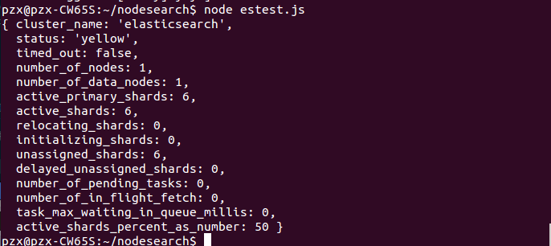
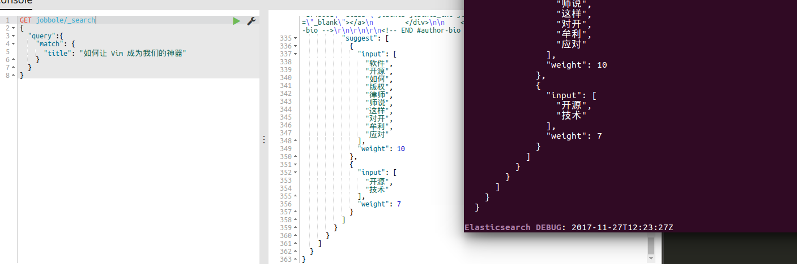

# nodejs结合ES

## 1 安装模块：
参照文档：[npm官网文档](https://www.npmjs.com/package/elasticsearch)

参照文档：[ES官方文档](https://www.elastic.co/guide/en/elasticsearch/client/javascript-api/current/index.html)

先安装模块：
```
npm install elasticsearch --save
```
然后，新建一个项目文件夹，名为`nodesearch`。然后在项目文件夹里新建一个`estest.js`文件,创建一个ES客户端：
```javascript
var elasticsearch = require('elasticsearch');
var client = new elasticsearch.Client({
  host: 'localhost:9200',
  log: 'trace'
});

//获取elasticSearch状态
client.cluster.health(function (err, resp) {
    if (err) {
        console.error(err.message);
    } else {
        console.dir(resp);
    }
});
```
执行一下：



然后加入查询语句试试：
```javascript
client.search({
    index: 'jobbole',
    type: 'artcile',
    body:{
        query:{
            match:{
                title: "如何让 Vim 成为我们的神器"
            }
        }
    }
}).then(function(response) {
    var hits = response.hits.hits;
    console.log(hits);
},function (error) {
    console.trace(error.message);
});
```
然后在ES的kibana里执行同样的语句看一下查询结果是否一致：



两处查询到的结果都是一样的。接下来就是把ES整合到Express里。打造一个搜索引擎。
