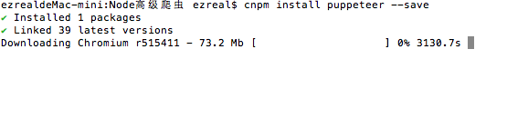
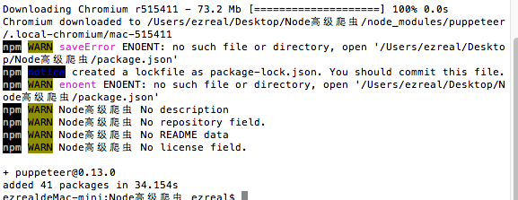
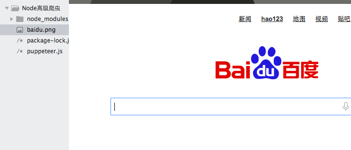

# node高级爬虫技术Puppeteer

## 1 安装测试puppeteer
首先，为这个项目安装必须的模块——puppeteer：
```
$ npm install puppeteer --save
```
安装进行中:



安装完成：



安装完成后，有一些警告，这是因为我们在创建项目的时候没有初始化`package.json`，但是不影响使用,可以这样测试一下：
```javascript
const puppeteer = require('puppeteer');

(async()=>{
	const browser = await puppeteer.launch();
	const page = await browser.newPage();
	await page.goto('https://www.baidu.com');
	await page.screenshot({path:'baidu.png'});

	await browser.close();
})()
```
这段代码就是使用puppeteer框架打开““百度””然后进行截图。执行一下：



执行成功了，在我们的项目文件夹下，多了一张名为“baidu.png”的图片。

如果想要访问国外的网站，加入代理即可：
```javascript
const puppeteer = require('puppeteer');

(async()=>{
	const browser = await puppeteer.launch({
    args:['--proxy-server=代理地址']
    });
	const page = await browser.newPage();
	await page.goto('https://www.baidu.com');
	await page.screenshot({path:'baidu.png'});

	await browser.close();
})()
```
由于这是一个无界面的浏览器，所以运行的时候是没有界面的，如果想要界面的话，可以这样来配置：
```javascript
const browser = await puppeteer.launch({
    headless:false
    });
```
然后运行的时候就会打开一个浏览器界面：


