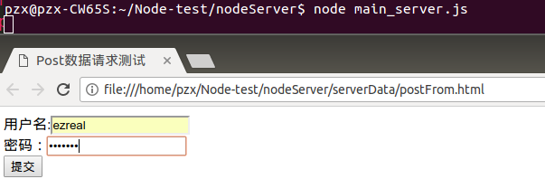
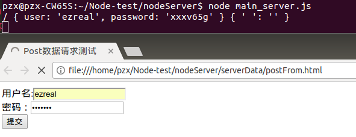
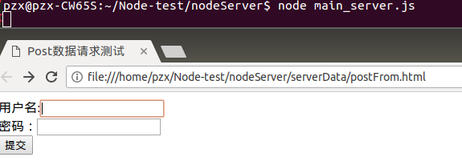
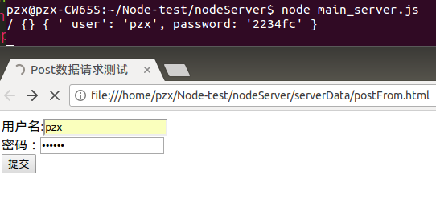
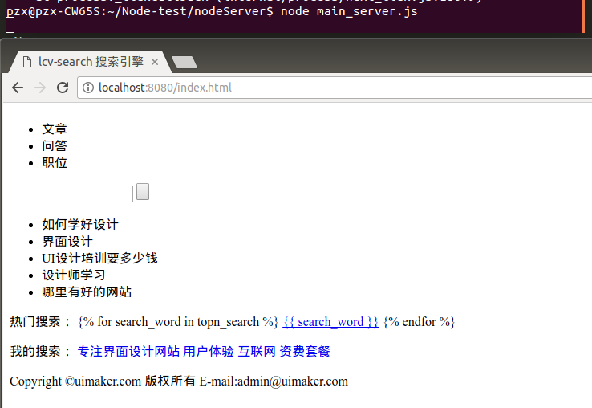
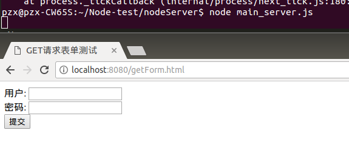
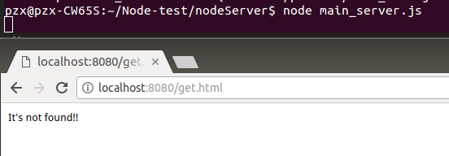

# POST+GET请求处理
## 1 POST+GET
想要把POST和GET数据请求一起处理，把他们放在一起就可以了：
```javascript
//Post+get请求处理
const http = require('http');
const fs = require('fs');
const querystring = require('querystring');
const urlLib = require('url');

var server = http.createServer(function (req, res) {
    //处理GET请求
    var obj = urlLib.parse(req.url, true);
    var url = obj.pathname;
    const getDatas = obj.query;

    //处理POST请求
    var str = ' ';
    req.on('data', function (data) {
        str += data;
    });
    req.on('end', function () {
        const postDatas = querystring.parse(str);

    console.log(url, getDatas, postDatas);
    });
    
});
server.listen(8080);
```
运行一下：



首先验证的是处理get请求。填入数据，然后提交：



成功处理GET数据，接下来是处理POSt数据：



同理，填入数据后提交：



POST数据请求处理成功。

## 2 加入文件请求
把前面写的文件请求的代码粘贴进来就行了：
```JavaScript
//Post+get请求处理
const http = require('http');
const fs = require('fs');
const querystring = require('querystring');
const urlLib = require('url');

var server = http.createServer(function (req, res) {
    //处理GET请求
    var obj = urlLib.parse(req.url, true);
    var url = obj.pathname;
    const getDatas = obj.query;

    //处理POST请求
    var str = ' ';
    req.on('data', function (data) {
        str += data;
    });
    req.on('end', function () {
        const postDatas = querystring.parse(str);

    // console.log(url, getDatas, postDatas);
    //文件请求处理
    var file_name = 'serverData' + url; 
    fs.readFile(file_name, function (err, data) {
        if (err) {
            res.write("It's not found!!");
        }else{
            res.write(data);
        }
        res.end();
    });
    });
});
server.listen(8080);
```
完成以后运行一下：





当我们访问存在的文件时都是正常处理的，现在来访问一个不存在的文件试试能否正常处理：



可以看到，访问不存在的文件时，也是能够正常处理的。