# Node搭建文件系统1
## 1 测试文件读写
首先，建立一个项目目录，结构如下：

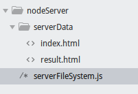

然后编辑`serverFileSystem.js`来测试一下：
```javascript
const http = reqiure('http');
const fs = reqiure('fs');

var server = http.createServer(function (req, res) {
    var file_name = 'serverData' + req.url;

    fs.readFile(file_name, function (err, data){
        if (err) {
            res.write("It's not found!!");
        } else{
            res.write(data);
        }
    });
    res.end();
});

server.listen(8888);
```
打开终端，运行一下：

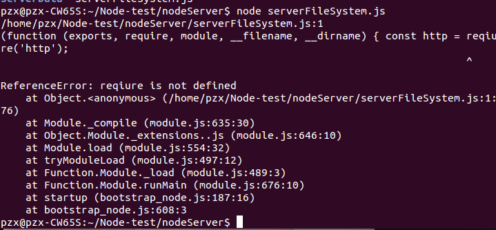

报错了，是单词拼写错误。修改一下再运行：

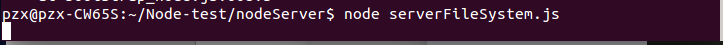

修改以后运行成功了，访问一下`8888`端口：

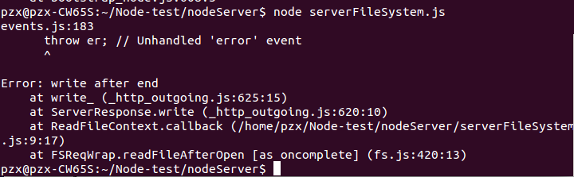

访问时出错了，好像是文件读写函数的问题，修改代码，测试一下：
```JavaScript
const http = require('http');
const fs = require('fs');

var server = http.createServer(function (req, res) {
    var file_name = 'serverData' + req.url;

    fs.readFile(file_name, function (err, data){
        if (err) {
            res.write("It's not found!!");
        } else{
            // res.write(data);
            console.log('1');
        }
    });
    // res.end();
    console.log('2');
});

server.listen(8888);
```
然后运行一下：

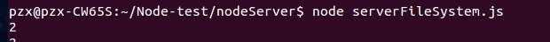

可见，由于是异步函数回调，所以先执行了下面的代码，再返回来执行回调函数的代码，所以在文件还没有开始读取就把文件读取关闭了，可以这样修改：
```JavaScript
const http = require('http');
const fs = require('fs');

var server = http.createServer(function (req, res) {
    var file_name = 'serverData' + req.url;

    fs.readFile(file_name, function (err, data){
        if (err) {
            res.write("It's not found!!");
        } else{
            res.write(data);
        }
        res.end();
    });
});

server.listen(8888);
```
运行，访问一下我们的文件：

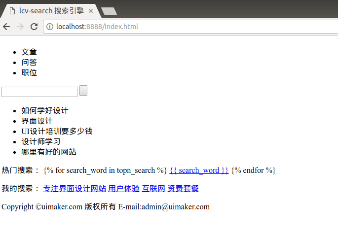

访问成功，如果访问一个不存在的文件：

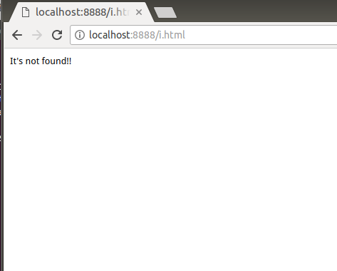

如果文件不存在，它就会执行另一个操作。给出不存在的原因。

## 2 接收前台请求
前台向后台发送的典型请求有：from、ajax、jsonp。。。；
数据请求对于后台来说，都是通过http请求来实现。只是请求方式的不同，例如：
* GET：数据在URL中；
* POST：数据不再URL中。

首先，写一个简单的`form.html`文件：

```JavaScript
<!DOCTYPE html>
<html>
<head>
    <title>Nodejs表单测试</title>
    <meta charset="utf-8">
</head>
<body>
    <form action="http://localhost:8888/" method="get">
      用户:
      <input type="text" name="user" value="">  <br>
      密码:
      <input type="password" name="password" value=""><br>
      <input type="submit" value="提交">
    </form>
</body>
</html>
```
然后写一个服务器`server.js`文件：
```JavaScript
const http = require('http');

http.createServer(function (req, res) {
    console.log(req.url);
    res.write("data submit successful!!");
    res.end();
}).listen('8888');
```
运行`server.js`，再运行`form.html`：

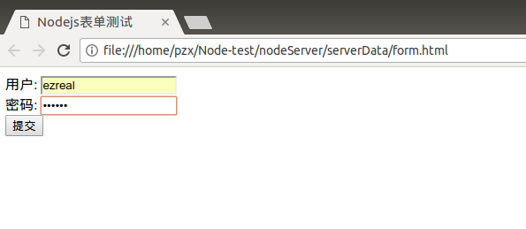

随便填入数据，然后点击“提交”：

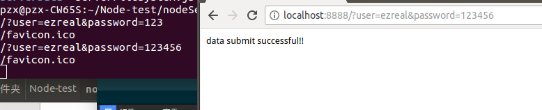

提交数据后，成功跳转到了服务器，接下来开始提取请求的数据。

## 3 提取请求数据

### 1 get请求

想要获得浏览器的请求数据,可以调用Nodejs的`url`模块：
```javascript
const http = require('http');
const urlLib = require('url');

http.createServer(function (req, res) {
    var obj = urlLib.parse(req.url, true);
    var url = obj.pathname;
    var getData = obj.query;

    console.log(url, getData);
    res.write("data submit successful!!");
    res.end();
}).listen('8888');
```
然后运行表单HTML文件：

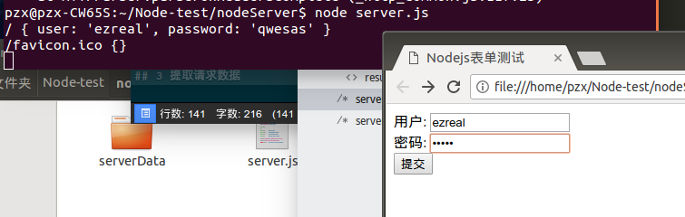

随便填入信息后提交，然后：

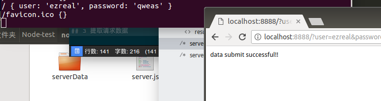

后台已经获得了前台get请求的数据。

### 2 POST请求
在请求的数据中，GET数据处于`head`文件之中。`head`最大是32k；POST数据就比GET数据大得多。

首先，创建`postServer.js`:
```JavaScript
const http = require('http');

http.createServer(function (req, res) {
    var str = ' ';
    req.on('data', function (data) {
        console.log('第${i++}次收到数据');
        str += data;
    });
    req.on('end', function() {
        console.log(str);
    });
}).listen(8080);
```
然后建立`postFrom.html`文件：
```JavaScript
<!DOCTYPE html>
<html>
<head>
    <title>Post数据请求测试</title>
    <meta charset="utf-8">
</head>
<body>
    <form action="http://localhost:8080/user" method="post">
        用户名:<input type="text" name="user"><br>
        密码：<input type="password" name="password">
        <input type="submit" value="提交">
    </form>
</body>
</html>
```
然后开启nodejs服务器，再运行表单文件：

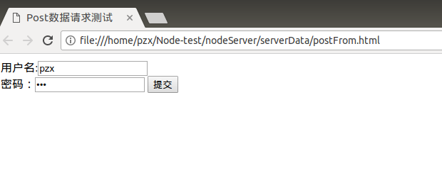

填入数据后运行一下：

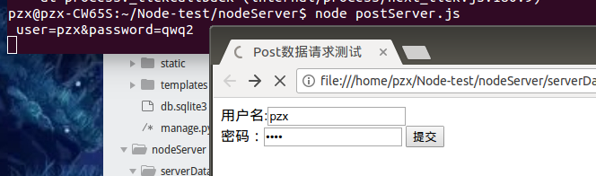

已经获得了来自浏览器的POST的数据。接下来就是Post数据格式化：
```javascript
const http = require('http');
const querystring = require('querystring');

http.createServer(function (req, res) {
    var str = ' ';
    var i = 0;
    req.on('data', function (data) {
        str += data;
    });
    req.on('end', function() {
        var post = querystring.parse(str);
        console.log(post);
    });
}).listen(8080);
```
提交数据后：

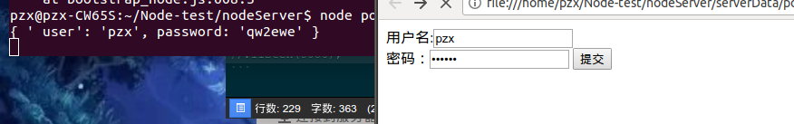