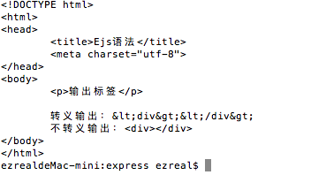
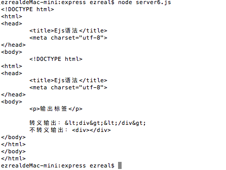

# EJS模板语法

## 1 安装
终端进入到项目文件夹，然后执行：
```
$ cnpm install ejs
```

## 2 基础语法
建立一个`.js`和`.ejs`文件，首先，`.js`：
```javascript
const ejs = require('ejs');

ejs.renderFile('./static/1.ejs', {json: {arr: [
	{user: 'ezreal', paswd: '123456'},
	{user: 'pzx', paswd: '22333'},
	{user: 'zgq', paswd: '66666'},
]}}, function(err, data) {
	console.log(data);
});
```
然后是编辑`.ejs`文件:
```css
<!DOCTYPE html>
<html>
<head>
	<title>EJS基础使用方法</title>
	<meta charset="utf-8">
</head>
<body>
	<div><%=json.arr[0].user%></div>
</body>
</html>
```
ejs模块使用`<%= %>`输出数据。其语法和原生JS并没有太多的区别，可以试试循环：
```css
>% <%
<% for(var i=0; i<json.arr.length;i++){ %>
	这里是输出内容的地方。
	<% } %>
```
```css
<!DOCTYPE html>
<html>
<head>
	<title>EJS基础使用</title>
	<meta charset="utf-8">
</head>
<body>
	<% for(var i=0; i<json.arr.length;i++){ %>
	<div><%= json.arr[i].user %><p><%= json.arr[i].passwd %></p></div>
	<% } %>
</body>
</html>
```
如果想要打印出标签，可以这样来打印：
```css
<% var str="<div></div>" %>
<%= str %> //转义输出
<%- str %> //不转义输出
```
这就是转义输出和不转义输出的区别：



## 3 引用
在ejs中，可以引用其他文件或者数据，使用`include`:
```css
<!DOCTYPE html>
<html>
<head>
	<title>Ejs语法</title>
	<meta charset="utf-8">
</head>
<body>
	<% include 3.ejs %>
</body>
</html>
```



