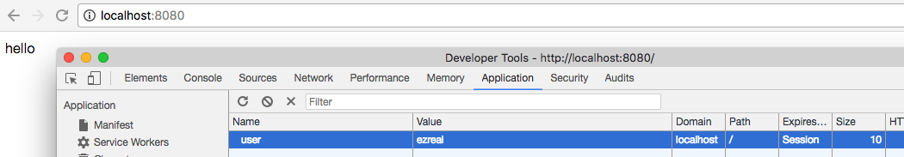
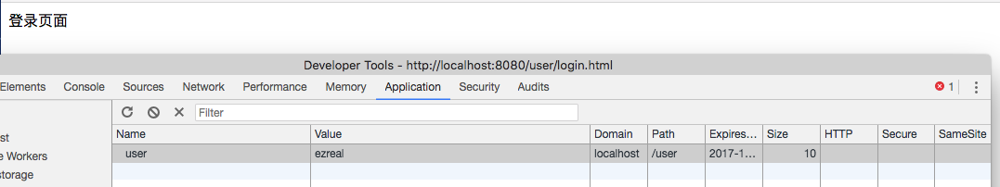
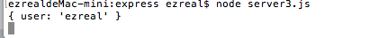
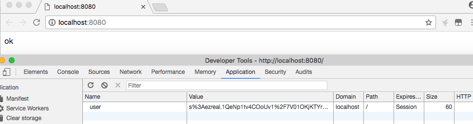
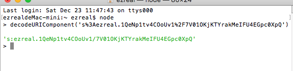
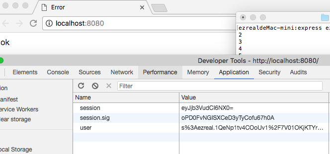

# Node-cookie、session

### 1 cookie
存在客户端浏览器上的一些请求信息。
1.发送cookie--
###### 返回一个`cookie`:
```javascript
const express = require('express');
var server = express();

server.use('/', function() {
	res.cookie('user', 'ezreal');
	res.send('hello');
});

server.liseten(8080);
```



###### 指定可以使用cookie的路径和过期时间：
```javascript
var express = require('express');
var server = express();

server.use('/user/login.html', function() {
	res.cookie('user', 'ezreal', {path:'/user', maxAge: 10*24*3600*1000});
    res.send('登录页面');
});
server.listen(8080)
```



2.读取cookie
需要模块`cookie-parser`:`npm install cookie-parser`。
```javascript
const express = require('express');
const cookieParser = require('cookie-parser');
var server = express();

server.use(cookieParser());

server.use('/user/login.html', function() {
	console.log(req.cookies);
    res.send('hello');
});

server.listen(8080);
```



3.加密cookie
```javascript
const express = require('express');
const cookieParser = require('cookie-parser');
const server = express();

server.use(cookieParser());
server.sue('/', function(req, res) {
	req.secret = 'asdasd';
	res.cookie('user', 'ezreal', {signed:true});
	res.send('ok');
})
server.listen(8080);
```
cookie被加密,不再是明文：



其实，这算不上是加密，只是使用`URIcode`进行签名，比较简单，可以轻易被破解：



但是可以防止`cookie`被修改。

### 2 session
session基于cookie实现的。cookie中会有一个session的ID，服务器利用session_id找到session文件、读取、写入。

1.写入session
```javascript
const express = require('express');
const cookieSession = require('cookie-session');
const server = express();
server.use(cookieSession({
	name: 'sess',
	keys: ['aaa', 'bbb', 'ccc'],
    maxAge: 10*24*3600*1000
}));
server.use('/', function(req, res) {
	if(req.session['count']==null){
    	req.session['count']=1;
    }else{
    	req.session['count']++;
    }
    console.log(req.session['count']);
    res.send('ok');
});
server.listen(8080);
```




但是存在隐患，session_id泄露会造成session劫持。
想要在nodeJS中使用session，需要模块`cookie-session`:`npm install cookie-session`