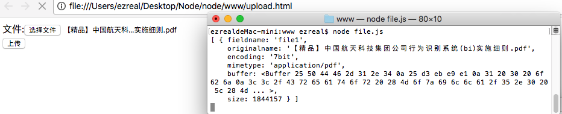

# express模块整合
[toc]
## 1 安装模块

首先，需要一些模块来实现请求、数据解析、视图引擎等。
```
$ cnpm install express express-static body-parser cookie-parser cookie-session jade ejs
```
## 2 框架整合

### 2.1 服务器实现

```javascript
const express = require('express');
const static = require('express-static');
const bodyParser = require('body-parser');
const cookieParser = require('cookie-parser');
const cookieSession = require('cookie-session');
const ejs = require('ejs');
const jade = require('jade');

var server = express();

server.listen(8080);
```

### 2.2 解析cookie

```javascript
const express = require('express');
const static = require('express-static');
const bodyParser = require('body-parser');
const cookieParser = require('cookie-parser');
const cookieSession = require('cookie-session');
const ejs = require('ejs');
const jade = require('jade');

var server = express();

server.listen(8080);
//解析cookie
server.use(cookieParser('q1212sas'));
```

### 2.3 解析session

```javascript
const express = require('express');
const static = require('express-static');
const bodyParser = require('body-parser');
const cookieParser = require('cookie-parser');
const cookieSession = require('cookie-session');
const ejs = require('ejs');
const jade = require('jade');

var server = express();

server.listen(8080);
//解析cookie
server.use(cookieParser('q1212sas'));
//解析session
var arr = [];
for(i=0;i<1000;i++){
	arr.push('keys_'+Math.random);
}
server.use(cookieSession({name: 'sess_id', keys: arr, maxAge: 20*60*1000}));
```

### 2.4 处理post

```javascript
const express = require('express');
const static = require('express-static');
const bodyParser = require('body-parser');
const cookieParser = require('cookie-parser');
const cookieSession = require('cookie-session');
const ejs = require('ejs');
const jade = require('jade');

var server = express();

server.listen(8080);

//解析cookie
server.use(cookieParser('q1212sas'));

//解析session
var arr = [];
for(i=0;i<1000;i++){
	arr.push('keys_'+Math.random);
}
server.use(cookieSession({name: 'sess_id', keys: arr, maxAge: 20*60*1000}));

//处理post
srerver.use(bodyParser.urlencoded({extended: false}));
```

### 2.5 处理静态文件

```javascript
const express = require('express');
const static = require('express-static');
const bodyParser = require('body-parser');
const cookieParser = require('cookie-parser');
const cookieSession = require('cookie-session');
const ejs = require('ejs');
const jade = require('jade');

var server = express();

server.listen(8080);

//解析cookie
server.use(cookieParser('q1212sas'));

//解析session
var arr = [];
for(i=0;i<1000;i++){
	arr.push('keys_'+Math.random);
}
server.use(cookieSession({name: 'sess_id', keys: arr, maxAge: 20*60*1000}));

//处理post
srerver.use(bodyParser.urlencoded({extended: false}));

//处理静态文件
server.use(static('./www'));
```

### 2.6 处理用户请求

```javascript
const express = require('express');
const static = require('express-static');
const bodyParser = require('body-parser');
const cookieParser = require('cookie-parser');
const cookieSession = require('cookie-session');
const ejs = require('ejs');
const jade = require('jade');

var server = express();

server.listen(8080);

//解析cookie
server.use(cookieParser('q1212sas'));

//解析session
var arr = [];
for(i=0;i<1000;i++){
	arr.push('keys_'+Math.random);
}
server.use(cookieSession({name: 'sess_id', keys: arr, maxAge: 20*60*1000}));

//处理post
srerver.use(bodyParser.urlencoded({extended: false}));

//处理用户请求
server.use('/', function(req, res, next) {
	console.log(req.query, req.body, req.cookies, req.session);//测试是否解析成功
});

//处理静态文件
server.use(static('./www'));
```
然后测试一下是否解析成功：


## 3 上传文件
我们用来处理数据请求的模块一般是`body-parser`和`post`，但是，`post`只能处理普通数据请求，无法处理上传文件的请求：
```javascript
const express = require('express');
const bodyParser = require('body-parser');
var server = express();
server.use(bodyParser.urlencoded({extended: false}));
server.post('/', function(req, res) {
	console.log(req.files);
});
server.listen(8080);
```
然后写个`html`文件来测试一下：
```css
<!DOCTYPE html>
<html>
<head>
	<title>test</title>
</head>
<body>
	<form action="http://localhost:8080/" method="post" enctype="multipart/form-data">
		文件:<input type="file" name="file1" /><br>
		<input type="submit" value="上传">
	</form>
</body>
</html>
```
测试结果：


上传失败，所以。`body-parser`不能处理文件上传，可以使用`multipart`这个模板来处理文件上传：
```javascript
const express = require('express');
const bodyParser = require('body-parser');
const multer = require('multer');

var objMulter = multer();
var server = express();
server.use(objMulter.any());
server.use(bodyParser.urlencoded({extended: false}));
server.post('/', function(req, res) {
	console.log(req.files);
});
server.listen(8080);
```
然后再运行一下表单文件，再次上传文件：



上传成功。但是可以看到，这样上传的文件会直接保存在内存里，如果是一个大文件的话会造成内存溢出，所以要修改一下，让文件可以直接保存在磁盘上。
```javascript
const express = require('express');
const bodyParser = require('body-parser');
const multer = require('multer');

var objMulter = multer({dest: './upload'});
var server = express();
server.use(objMulter.any());
server.use(bodyParser.urlencoded({extended: false}));
server.post('/', function(req, res) {
	console.log(req.files);
});
server.listen(8080);
```
修改完成后，运行表单文件试一试：


可以看到，已经上传成功了，在`upload`文件夹中，已经有了文件：


但是名字和文件拓展名不见了，所以可以利用`fs`模块来进行重命名：
```javascript
const express = require('express');
const bodyParser = require('body-parser');
const multer = require('multer');
const path = require('path');
const fs = require('fs');

var objMulter = multer({dest: './upload'});
var server = express();
server.use(objMulter.any());
server.use(bodyParser.urlencoded({extended: false}));
server.post('/', function(req, res) {
	var newName = req.files[0].path + path.parse(req.files[0].originalname).ext;
    fs.rename(req.files[0].path, newName, function(err){
    	if(err){
        	res.send('上传失败');
        }else{
        	res.send('上传成功')
        }
    });
});
server.listen(8080);
```
上传成功，并且保存了文件拓展名：


对于`body-parser`,它可以处理一些简单的数据提交表单，默认为`application/x-www-form-urlencoded`,而`multer`就用来处理文件提交的表单。它的`enctype="multipart/form-data"`

## 4 模板引擎适配
在Node中，可以使用`consolidate`来适配不同的模板引擎，避免项目自身过于冗余。
安装:
```
$ cnpm install consollidate
```
使用：
```javascript
const express = require('express');
const static = require('express-static');
const bodyParser = require('body-parser');
const cookieParser = require('cookie-parser');
const cookieSession = require('cookie-session');
const multer = require('multer')
const consolidate = require('consolidate');

var server = express();

server.listen(8080);

//解析cookie
server.use(cookieParser('asdzxc'));

//解析session
var arr = [];

for(var i=0;i<1000;i++){
	arr.push('keys_'+Math.random());
}
server.use(cookieSession({name: 'sess_id', keys: arr, maxAge: 20*60*1000}));


//处理post
server.use(bodyParser.urlencoded({extended: false}));
server.use(multer({dest:'./www/upload/'}).any());

//处理模板引擎
server.set('view engine', 'html');
server.set('views', './views');
server.engine('html', consolidate.ejs);

//用户请求
// server.use('/', function (req, res, next) {
// 	console.log(req.query, req.body, req.cookies, req.session);
// });
server.use('/index', function(req, res) {
	res.render('index.html', {next: '如梦'});
});

//处理静态文件
server.use(static('./www'));
```
启动服务器执行一下：


模板引擎适配成功。

## 5 路由
路由用于网站结构较为复杂时使用，例如，在一个大型网站为用户写一个路由：
```javascript
const express = require('express');
var server = express();

var routerUser = express.Router();
routerUser.get('/login.html', function(req, res) {
	res.send('登录页面');
});
routerUser.get('/reg.html', function(req, res) {
	res.send('注册页面');
});
routerUser.get('/user.html', function(req, res) {
	res.send('用户主页面');
});
server.use('user', routerUser);
server.listen(8080);
```
