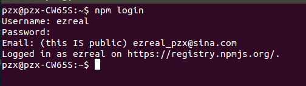
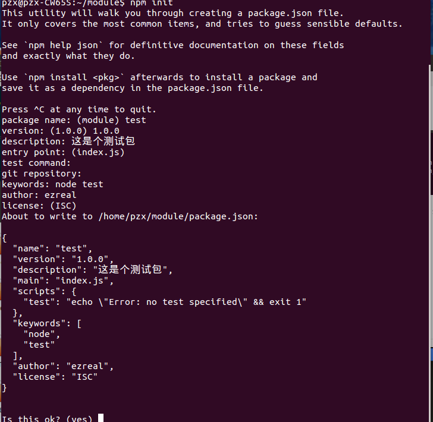
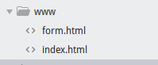
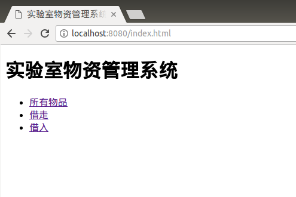
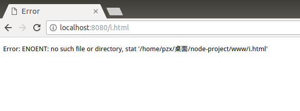
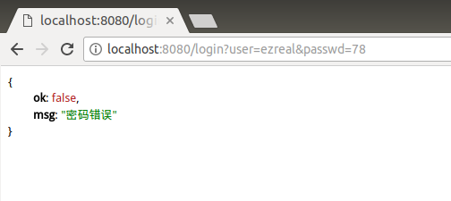
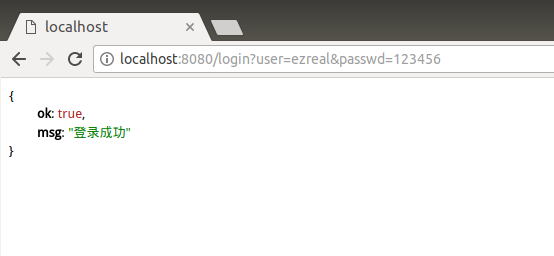

# Nodejs模块化及express请求处理验证

## 1. 常用系统模块
1. Crypto 加密
2. Events 事件
3. File System 文件操作
4. Net 网络操作
5. OS 操作系统信息
6. Path 处理文件路径
7. Stream 流操作
8. Timer 定时器
9. ZLIB 压缩

## 2 自定义模块

### 1. 模块组成

* require：请求模块：如果有`./`从当前目录寻找；如果没有，则先从系统模块寻找，找不到的话再从`node_modules`找。
* module：模块：批量输出
* exports：对外输出

### 2. npm

npm全称`Nodejs package manager`(Nodejs包管理器)，提供模块同意的下载途径；可以自动下载依赖。
基本用法：
* `npm install 模块名`：安装模块
* `npm uninstall 模块名`：卸载模块
* `npm update 模块名`：发布模块

### 3. 发布模块

模块发布过程：
* 登录：
  
  
  
  打开终端输入`npm login`,然后输入用户名、密码和邮箱即可。
* 定义模块：
  ```
  $ npm init
  ```
  然后依次填入相关信息即可
  
  

* 发布：`npm publish`
* 删除：`npm --force unpublish`

## 3 三种数据请求的区别

1. `get('/',function(re, res) {}):` 接收GET请求
2. `post('/',function(re, res) {}):` 接收POST请求
3. `use('/',function(re, res) {}):` POST、GET请求都能接收

## 4 express解析浏览器端请求
首先，使用express创建一个服务器：
```javascript
const express = require('express');
const server = express();

const runserver = server.listen(8080, function() {
	console.log('服务运行在%s端口', runserver.address().port)
})
```
将上面的代码保存为'main.js'。

然后，添加文件读写模块：
```
$ cnpm install express-static --save
```
在项目文件夹下新建一个名为`www`的文件夹，用来放置文件，然后再在`main.js`中加入模块：
```javascript
const express = require('express');
const static = require('express-static');
const server = express();

server.use(static('./www'))
const runserver = server.listen(8080, function() {
	console.log('服务运行在%s端口', runserver.address().port)
})
```
现在可以看一下我们的`www`下的文件有哪些：



我们运行main.js，然后访问一个在`www`中的文件：



可以看到，已经成功的打开了文件，如果访问一个不存在的文件呢：



如果文件不存在，就会报错。

## 5 express解析请求
首先，在mian.js中增加数据请求解析的功能，先测试一下：
```javascript
const express = require('express');
const static = require('express-static');
const server = express();

const runserver = server.listen(8080, function() {
	console.log('服务运行在%s端口', runserver.address().port)
});
server.get('/login', function(req, res) {
	console.log(req.query);
});
server.use(static('./www'))
```
运行一下，测试是否能解析：


解析成功，下面开始定义数据解析：
```javascript
const express = require('express');
const static = require('express-static');
const server = express();

const runserver = server.listen(8080, function() {
	console.log('服务运行在%s端口', runserver.address().port)
});

//数据解析模块
//预定义用户数据
var users = {
    'ezreal': '123456',
    'zgq': '2233',
    'hyb': '4455'
};
server.get('/login', function(req, res) {
	var user = req.query['user];
    var passwd = req.query['passwd'];
    
    //与数据库用户进行对比
    if (users[user]==null) {
    	res.send({ok:false, msg:'用户不存在'});
    } else {
    	if (users[user]!=passwd) {
        	res.send({ok:false, msg:'密码错误'});
        } else {
        	res.send({ok:true, msg:'登录成功'});
        }
    }
});
server.use(static('./www'))
```
然后保存运行一下,先输入一个不存在的用户试试：


再输入一个存在但是密码错误的试试：



输入正确的用户名和密码试试：



我们的服务器已经能够正确处理文件请求和数据请求了，并且能够进行数据验证。

## 6 登录页面
写入登录页面`login.html`
```JavaScript
<!DOCTYPE html>
<html>
<head>
    <title>管理系统登录</title>
    <meta charset="utf-8">
    <script src="ajax.js" charset="utf-8"></script>
    <script src="jquery-3.2.1.min.js"></script>
    <script type="text/javascript">
        window.onload=function() {
            var oUser = document.getElementById('user');
            var oPasswd = document.getElementById('passwd');
            var oLogin = document.getElementById('login');

            oLogin.onclick=function() {
                $.ajax({
                    url: '/login',
                    data: {user: oUser.value, passwd: oPasswd.value},
                    success: function(str){
                        var json = eval('('+str+')');
                        if (json.ok) {
                            alert('登录成功');
                        }else{
                            alert('失败'+json.msg);
                        }
                    },
                    error: function(){
                        alert('链接失败');
                    }
                });
            };
        };
    </script>
</head>
<body>
    用户名:<input type="text" id="user" /><br>
    密   码:<input type="password" id="passwd" /><br>
    <input type="button" value="登录" id="login" />
</body>
</html>
```
