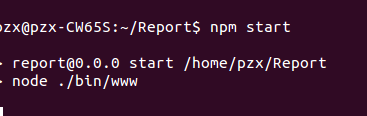
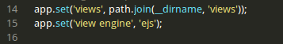
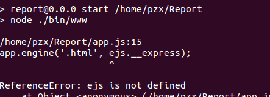
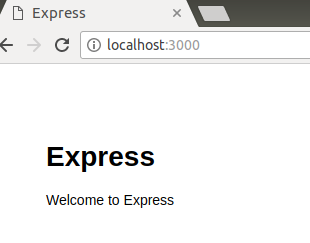
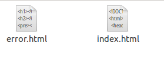
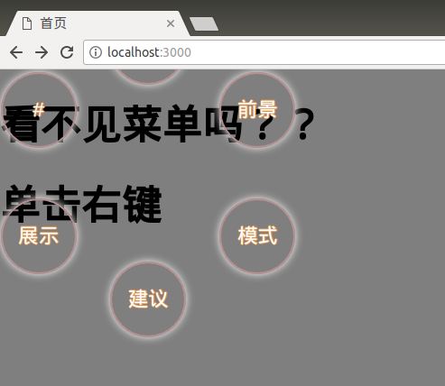
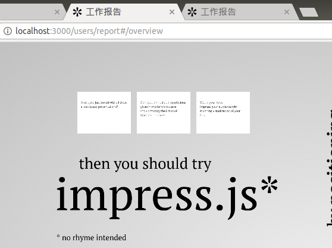

# Node+Express+Impress制作工作报告PPT

#### 1.使用Express创建项目
打开终端(以下操作必须安装NodeJS和Express才可以进行)：
```
$ express Report -e //使用Express生成一个项目，默认视图使用EJS
$ cd Report && npm install //安装所需要的模块
$ npm start //测试项目建立是否成功
```
**如果出现了下面的界面，则安装成功：**



#### 2.修改模板，使其视图文件支持HTML文件
打开`Report`文件夹下的`app.js`文件，找到这一行：



把`app.set('view engine', 'ejs');`注释掉，新增加：
```javascript
app.engine('.html', ejs.__express);
app.set('view engine', 'html');
```
然后打开`views`文件夹，将文件的后缀修改为`.html`。重新启动一下项目，验证修改是否成功：
```
$ npm start
```
运行后报错：



原来是没有引入`ejs`模块，在`app.js`加入`var ejs = require('ejs');`再次运行：



运行成功，而且视图文件都是HTML文件：



#### 3.创建视图文件，更改外观效果
NodeJs的视图文件放在`views`目录下，JS、CSS和图片等静态文件放在`public`这个目录下，把对应的文件放在对应的目录下，然后在html中引用即可。

我的模板已经修改了一点点了，给出一个大致的效果：



代码上传到github。**修改ing**（September 25, 2017 5:51 PM）
修改完成（September 25, 2017 6:12 PM）：


#### 4.修改路由，增加多页面
打开路由文件夹`routes`下的`users.js`文件，加入下面的代码:
```javascript
router.get('/report', function (req, res, next) {
	res.render('report');
});
```
这样，就增加了一个页面。如果需要增加多个页面，把上面的代码多复制几次，修改对应参数就可以了。

#### 5.使用impress制作炫酷PPT
先现在impress的源码，放到Node-Express项目的相应文件夹下面，然后修改源代码，直到获得你想要的效果。
**这是我的运行效果：**



接下来，就是书写你自己的页面了。让它变得更完美吧！！

#### 6.使用自定义字体
如果嫌弃impress自定义的字体不够好看，可以使用如下代码进行自定义字体：
```css
@font-face {
     font-family: caidie;//字体的名称，随便起，引用的时候用这个
     src: url('/images/caidie.ttf');//字体存放的路径
   }
```
引用字体：
```css
p{
font-family: caide;//刚才定义的名字
}
``
ok,展示一下效果：


